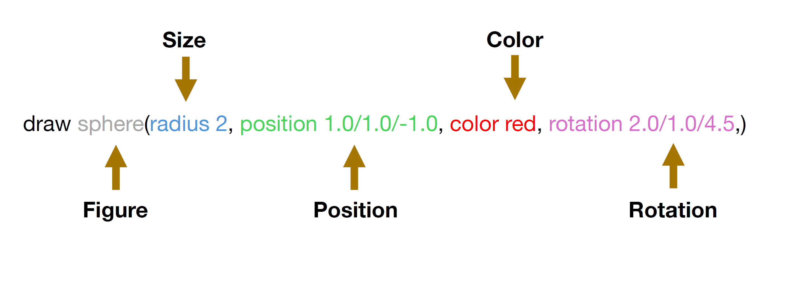

# 3D Figure Generator

## Description

The project is divided into two parts:
1. A React application that transforms a custom domain-specific language (DSL) into a scene with 3D figures
2. A workflow to transform an SVG file into a custom DSL script

## 3D Figure Generator (DSL to 3D Scene)

A web-based 3D figure generator based on [React](https://reactjs.org/), [Three.js](https://threejs.org/) and [ANTLR language recognition tool](https://www.antlr.org/).

### Domain specific language (DSL)

The project accepts a custom domain-specific language (DSL) script as an input, that describes a scene with 3D figures. The DSL script is parsed using ANTLR and transformed into a scene with Three.js.

I. The DSL language supports the following shapes: 
- Sphere
- Box
- Pyramid

II. In order to parse the DSL script, the following syntax rules must be respected:
- Each shape must be initiated by the draw keyword
- Each shape must be followed by a set of parentheses
- Shapes must be separated by a semicolon ";"

Example input: **draw sphere()**

Example input: **draw sphere() ; draw box()**

III. Available parameters:
- Size (Box, Pyramid), Radius (Sphere)
- Position
- Color
- Rotation

IV. In order to add parameters to the shapes, the following syntax rules must be respected:
- Each parameter must be followed by a comma ","
- Each parameter must be included within the shape parentheses
- **position** and **rotation** must be a float
- **radius/size** must be an integer
- **color** can be either string or a hex value

Example input: **draw sphere(radius 2, position 1.0/1.0/1.0, color red, rotation 2.0/1.0/4.5,)**

Example input: **draw box(size 2/2/3, position 4.0/4.0/4.0, color blue, rotation 1.5/2.0/3.5,)**

Example input: **draw sphere(radius 2, position -1.0/1.0/-3.0, color red, rotation 1.0/1.0/4.5,) ; draw box(size 2/2/3, position -4.0/-4.0/-4.0, color blue, rotation 1.5/2.0/3.5,) ; draw pyramid(size 2/2/3, position 3.0/1.0/-1.0, color yellow, rotation 1.5/1.0/1.5,)**

### Getting started

#### `yarn dev`

Starts the development server.

#### `yarn antlr`

Generates ANTLR files, should be run after modifying the grammar.

#### `yarn lint`

Lints the code with ESLint and Prettier.

## SVG to DSL

The project also includes a workflow to transform an SVG file into the aforementioned custom DSL script.

In order to generate the DSL script from an SVG file, the following steps must be followed:

1. Create an SVG file with Inkscape. Only Rectangle, Circle and Star shapes are supported.

   > [!WARNING]
   > SVG file must be created with Inkscape, as the script relies on a namespace utilized by the Inkscape SVG format.

2. Provide the SVG file as an input to the **svgToXmi.py** Python script (**transformations/scripts** folder in the project root directory) in order to convert the SVG file into a custom [XMI metamodel](https://www.omg.org/spec/XMI/2.4.2/About-XMI).
   
   > [!NOTE]
   > The metamodel is an [Ecore metamodel](https://eclipse.dev/modeling/emft/search/concepts/subtopic.html), defined by the [Eclipse Modeling Framework](https://en.wikipedia.org/wiki/Eclipse_Modeling_Framework). It is located in the **transformations/models** folder in the root directory.

   The following transformations are applied:
   1. Shapes: rect, ellipse, path -> Box, Sphere, Pyramid
   2. Size: width, height, title (shape's title determines its depth) / rx -> width, height, depth / radius
   3. Position: cx, cy, layer (nesting level determines the z axis) -> x, y, z
   4. Color: color tag -> color
   5. Rotation: transform(rotate(x)) (shape rotation determines the rotation in script) -> rotation in x, y, z axes

3. Create and set up an [Acceleo project in Eclipse](https://eclipse.dev/acceleo/). Use the provided Ecore metamodel. Transform the XMI model, created in step 2., into the custom DSL script by running the **xmiToDsl.mtl** Acceleo transformation (**transformations/scripts** folder in the project root directory).

4. The output of the transformation is ready to be used as an input for the 3D Figure Generator.

The custom Ecore metamodel diagram:

